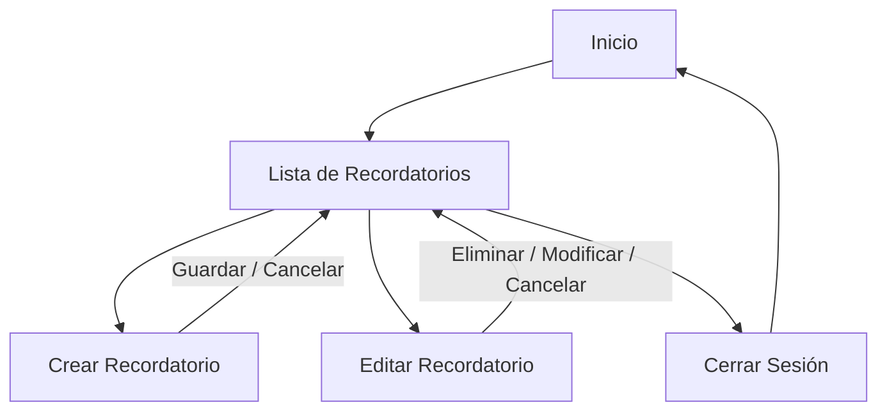

# MV_Recordatorio
# Índice
+ [Contecto de la aplicación](#contecto-de-la-aplicación)
  + [Problema del mundo real](#problema-del-mundo-real)
  + [Aplicaciones existentes](#aplicaciones-existentes)
  + [Mi aplicación](#mi-aplicación)
    + [Caso de uso](#caso-de-uso)
    + [Requisito Funcionales y No Funcionales](#requisito-funcionales-y-no-funcionales)
+ [Diseño](#diseño)
    + [GUI](#gui)
    + [Arquitectura](#arquitectura)
        + [Despliegue](#despliegue)
+ [Plan de Pruebas](#plan-de-pruebas)

## Contecto de la aplicación
### Problema del mundo real
Los aplicaciones de hoy en dia por lo visto solo es anotar texto y marcarlo en el calendario como aviso. Pero no puede avisarte como un alrma o una notificación. 

Además los datos no comparten la misma en diferentes dispositivos.

### Aplicaciones existentes
+ **Evernote:** Complejo, con funciones innecesarias para usuarios básicos.
+ **Google Keep:** Sencillo pero con organización limitada.
+ **Notion:** Potente pero con curva de aprendizaje alta.
+ **Apple Notes:** Solo para ecosistema Apple.

### Mi aplicación
+ **Simple y fácil de usar:** Interfaz simple y intuitiva para que los usuarios puedan crear y gestionar recordatorios de manera rápida y sencilla.
+ **Multiplataforma:** Android, iOS, Web.
+ **Notificaciones:** Avisos de recordatorio por notificación y alarmas dependiendo del tiempo, dia, mes y año. A cerca de la fecha establecida los 3 dias anteriores se le avisara hasta que se cumpla la fecha. Puede ser periodicos o una vez.
+ **Usuario:** Deberá registrarse para poder usar la aplicación. Así se podrá guardar los recordatorios y acceder a ellos desde cualquier dispositivo de la misma cuenta.

#### Caso de uso
+ **Inicio de sesión:** El usuario inicia sesión en la aplicación con sus credenciales.
+ **Crear recordatorio:** El usuario puede crear un nuevo recordatorio indicando título, descripción, fecha y hora. Puede ser periódico o único.
+ **Editar recordatorio:** El usuario puede modificar la información de un recordatorio existente.
+ **Eliminar recordatorio:** El usuario puede borrar un recordatorio que ya no necesita.
+ **Recibir notificaciones:** El sistema envía notificaciones y/o alarmas configuradas (ej: 3 días antes, 1 hora antes).
+ **Acceso a base de datos:** Los datos del usuario se guardan en una base de datos, permitiendo su acceso desde distintos dispositivos.

#### Requisito Funcionales y No Funcionales
+ **Funcionales:**
    + Crear, editar y eliminar recordatorios.
    + Notificaciones y alarmas de la fecha y configuración del recordatorio.

+ **No funcionales:**
    + Eficiencia
        + Cargar y mostrar recordatorios de manera fluida.
        + Margen de error en notificación y alarma entre 1 min.
    + Escalabilidad
        + Base de dato soporta +1000 datos.
    + Acesibilidad
        + Tamaño de fuente adaptable.
    + Usabilidad
        + Interfaz simple y fácil de usar.
        + Manual de usuario estructurado adecuadamente.

## Diseño
### GUI

+ Al entrar vemos que encima pone el nombre del usuario y la barra de menu, tenemos un RecycleView donde mustra todo los recordatorios creadas y un boton de agregar recordatorio.

+ Cuando se le da click en el boton de agregar recordatorio se abre un formulario donde se puede crear un recordatorio con el titulo, descripcion, fecha y hora. Tambien se puede elegir si es periodico o no.

+ Para eliminar o cambiar un recordatorio debemos dar click en el recordatorio y se abrira un formulario con los datos del recordatorio y podremos cambiarlos o eliminarlos.

#### Diagrama de Navegación

### Arquitectura
#### Diagrama de Despliegue

>Api : https://www.abstractapi.com/api/time-date-timezone-api

### Plan de Pruebas
+ Crear un recordatorio.
+ Editar un recordatorio.
+ Eliminar un recordatorio.
+ Los recordatorios se guardan en la base de datos.
+ Al llegar al tiempo la alarma se activa.